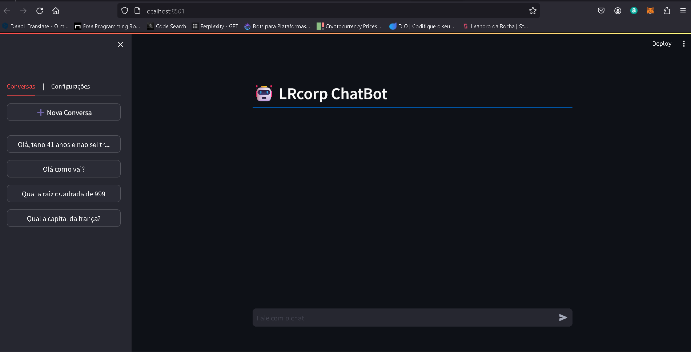

<h1>
    <a href='https://docs.streamlit.io/'>
     </a>
    <span>
Streamlit
</h1>

<h2><p align="center"> Repositório de Desenvolvimento Python - Streamlit</p></h2>
## 🚀 Tecnologias utilizadas:

-   Python
-   Logica de programação
-   Algoritmos e estruturas
-   Streramlit
-   LLM (API - ChatGPT, OpenAI)
-   Banco de Dados - EM BREVE
-   SQL - EM BREVE

## 📖 Descrição Streamlit:
O Streamlit é uma biblioteca de código aberto para criação de aplicativos da web interativos e visualizações de dados em Python. Ele permite que os desenvolvedores construam interfaces de usuário simples e poderosas diretamente a partir de scripts Python, sem a necessidade de conhecimento prévio em desenvolvimento web. Com uma sintaxe intuitiva e orientada a widgets, o Streamlit facilita a criação de aplicativos dinâmicos e responsivos. Ele oferece suporte integrado para componentes interativos, como botões, barras de progresso, gráficos e muito mais. O Streamlit é amplamente utilizado em ciência de dados, análise de dados e prototipagem rápida de aplicativos web.

## ✨ Features
Commit|Descrição|Data
|---|---|---|
|Inicial|Analisando dados FIFA23 - Jogo   | 12/04/2024|
|Build|ChatBot - LLM's_GPT |16/04.2024|

## Dependências
-   streamlit 
```
    pip install streamlit
```    
-   openai na versão 0.28.1
```    
    pip install openai==0.28.1
```    
-   dotenv;
```
    pip install python-dotenv
```
-   unicode;
```
    pip install unicode
```
    Demais bibliotecas padão do python!👨‍💻

### Para rodar o Streamlit, digite:🖥️

```
streamlit run app.py
```
Lembrando que para desfrutar da API (GPT-4 ou GPT3.5-Turbo), é necessário uma a compra de alguns tokens, valor minimo de **U$5,00** 💸💸💸

Em Breve faremos o ChatBot responder perguntas sobre uma base de dados (sendo preparada), usando a API do GPT da openAI, modelo mais poderoso disponivel atualmente.

## Nota 📝
Colar a cahve API no arquivo .venv.

A biblioteca dotenv. é para ler a api_key, sem mopstrar no codigo! Segurança.👮🚓🚨

Você pode acessar a documentação do streamlit, clicando no icone no inicio deste arquivo!

A pasta mensagens, é onde salva as mensagens do chat, para que o chat não seja perdido, caso o programa seja fechado. Ela esta com três exemplos, utilizados para teste! Caso queira começar zerado, é so apagar a pasta inteira, anter de rodar o Stream.

Botão de Configuração - OFF

## Foto - Cara! 🤖



## 📫 Contato

<h2>
    <a href='https://www.github.com/lerocha1'>
     </a>
    <a href='https://www.linkedin.com/in/leandro-rocha-62694730/'>
     </a>
    <span>
    <a href="mailto:leandro@lrcorp.com.br">
     </a>
    <span>
</h2>


## 🚀 Sobre mim
Pai, ciclista e apaixonado por Tecnologia, atuo como Gerente multidisciplinar em uma empresa de engenharia e que nas horas vagas "gasto" meu tempo com programação e desafios na internet.

Programando marjoritariamente em Python, também especialista em banco de Dados, Analise de dados/Big Data e programador FullStack.

Recentemente, me deparei programando em Go, linguagem que mais cresce no mundo.

